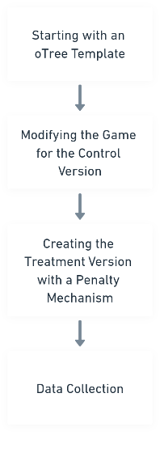

# Econ211_Zhe_Niu_Week4_Behavioral_Game

In my software development process, inspired by "Bonus and Penalty in Common Pool Resource Dilemmas under Uncertainty" by Amnon Rapoport and Wing Tung Au (2001), I implemented a two-player bargaining game using oTree. The control version of this game allowed each participant to independently claim a share of 100 currency units. If their combined claims did not exceed 100 units, each received their claimed amount. Otherwise, neither player received anything. This version ran for two rounds. In the treatment version, I integrated a penalty mechanism, modifying the set_payoffs function. Here, if the total claims exceeded 100 units, not only did the players receive nothing, but each also faced an additional penalty of 50 units. This modification was directly influenced by the research of Rapoport and Au, which examined how bonus and penalty treatments affected individual decision-making in resource allocation dilemmas. Their study found that penalty treatments were more effective in reducing individual requests and enhancing provision rates. By incorporating this penalty mechanism into the bargaining game, I aimed to explore its impact on individual decision-making strategies, especially under conditions of resource scarcity and potential loss.

Rapoport, A., & Au, W. T. (2001). Bonus and Penalty in Common Pool Resource Dilemmas under Uncertainty. Organizational Behavior and Human Decision Processes, 85(2), 135-159. doi:10.1006/obhd.2000.2935

